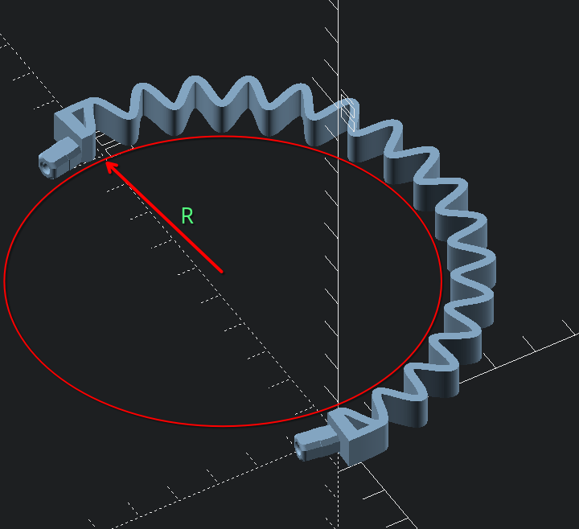

Headband
====

I am currently using [r=50 without coils](./export/band+coils=....0+th=....2+r=...50.stl).

## How to choose

The lower the `r`, the more closed default position is.

Thickness (`th`) can increase clamping force, but may also result in more brittle prints.

With [th=4 and r=30](./export/band+coils=....0+th=....4+r=...30.stl) you'll most probably get watermelon-between-thighs type of fit, so this repo truly offers wide range of experiences.

I haven't really experimented with number of coils yet, but I guess more coils can increase cushoning?
They do look kinda fun, and I've spent some time programming them, so do give them a try and report <3