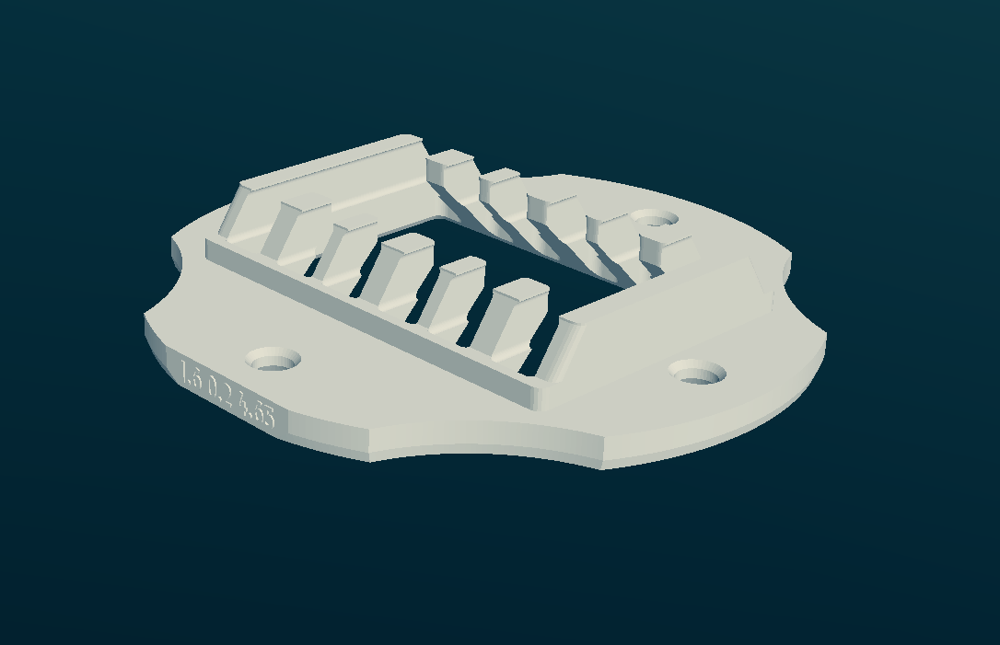
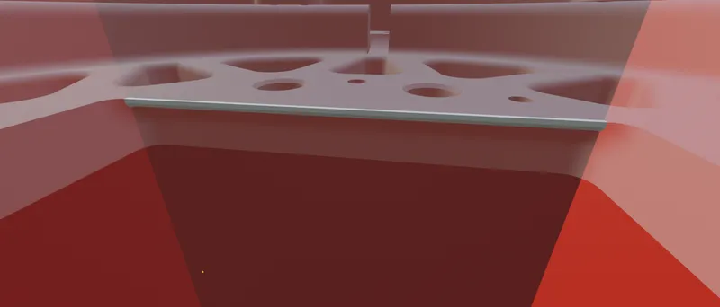

Newcap
====
This took forever, but they sure do plop louder now.

I am using [open 1.6 with 4.5 magnets, on 0.2 layer height](export/newcap+magnet_size=..4.5+open=..yes+h=..1.6+layer_height=..0.2.stl).

## How to choose

`magnet_size`: First of all, check your magnet width. It is usually 4.5mm, but I've encountered stock magnets being 4.8mm. Please report if you have some other different magnets.

`open`: This controls whether the holder exposes the driver, making the sound a lot more open, but also giving a lot more surface area for metal shavings and junk to stick to.

I find open variant nicer, and with less distortions, but Oratory is yet to test any of those caps on professional equipment.

`h`: This controls distance to inducer. The higher the value, the closer the magnets are.
Default is 1.6, but there is some variation in driver assemblies, so you might enjoy higher volumes on 1.8+ without any distortion.

`layer_height`: Top layer depends on print layer height. Printing on 0.1 can save you 0.1mm of potential travel for inducer, so it is recommended.

## How to install

You will either need either to cut some plastic from stock drivers or print [ones Xylite modelled](https://www.thingiverse.com/thing:6560552).

### Cutting plastic
You'll need to remove several perimeters (0.5mm) from the sides of driver frames, so the cap can with with magnets.

Here you can see where exactly you should cut:

**Cut with drivers disassembled** if you are not completely sure that you won't destroy your inducer in the process.

Ploopy wiki for how to assemble the drivers back is [here](https://github.com/ploopyco/headphones/wiki/Part-2%3A-Drivers).

Don't rush.